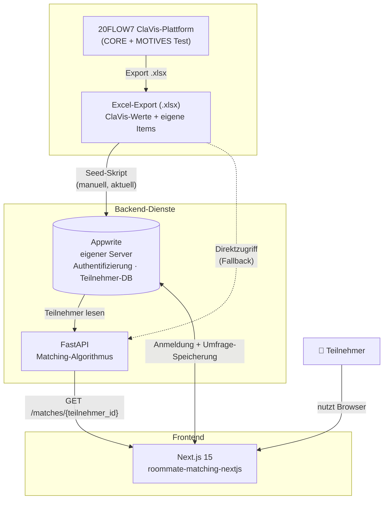
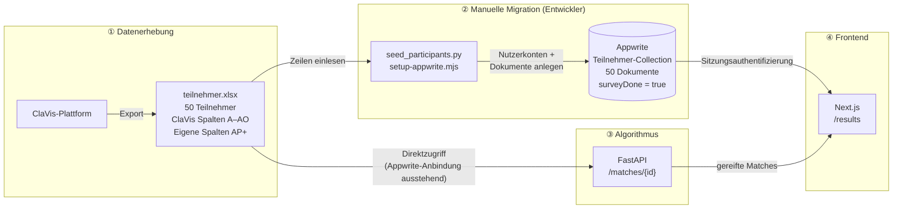
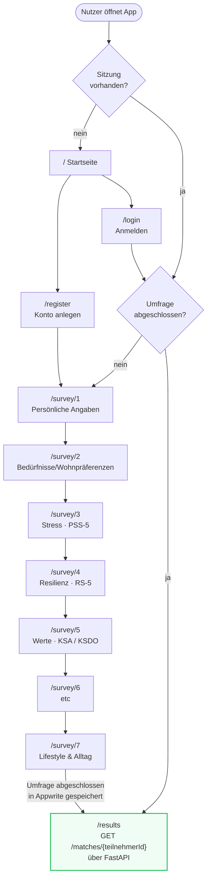

# Systemarchitektur — Wohnraum-Partnerschaften

Sprint Review · 27. Mai 2026

---

## 1. Highlevel System-Übersicht

---

## 2. Aktueller Datenfluss

Wie die Daten heute fließen, bevor die Appwrite-Anbindung im Algorithmus abgeschlossen ist.

---

## 4. User Experience — Ablauf im Frontend

---

## Aktueller Projektstatus

| Komponente | Status |
|------------|--------|
| Next.js Frontend (Anmeldung + Umfrage + Ergebnisse) | ✅ Fertig |
| Appwrite — Authentifizierung & Teilnehmer-Collection | ✅ Läuft (eigener Server) |
| FastAPI-Algorithmus (Excel-Datenquelle) | ✅ Funktionsfähig |
| Ergebnis-Ansicht mit Score-Aufschlüsselung | ✅ Fertig |
| FastAPI — Appwrite-Datenquelle | 🔄 In Arbeit |
| Manuelle Datenmigration Excel → Appwrite | 🔄 Aktueller Workaround |
| ClaVis Live-Integration | ⏳ Außerhalb POC-Umfang |
